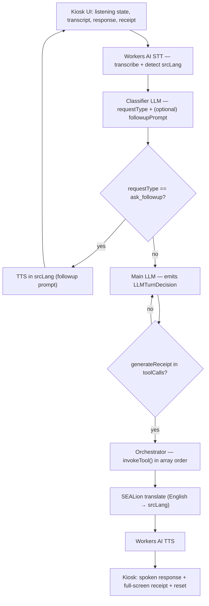
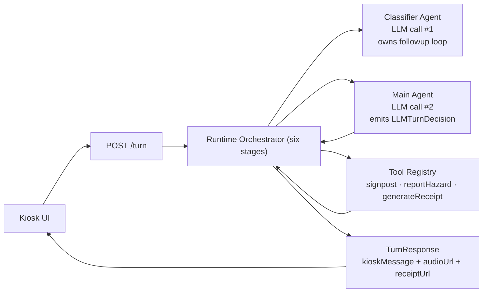

# System Design

> Canonical agent flow lives in `docs/refactor/2026-05-09-llm-turn-decision.md`. This file pins the broader architecture that surrounds it (stack, modules, persistence, security, extension points). When the two disagree, the refactor spec wins.

## Architecture Goal

Build a hackathon MVP **voice kiosk for elderly residents in HDB void decks**: voice-first triage in their language, signposting to the right agency / hotline / local resource, hazard reports filed on their behalf, and a printed receipt with the structured who/what/when/where/why/how so volunteers and counter staff can skip the retell. Demo runs on laptops. Major future integrations stay replaceable: speech provider, LLM, real hazard filing, real agency APIs, map provider, transport handoff.

## Stack

The stack is locked in `tech-stack.md`. In short:

- **Frontend:** Next.js 16 (App Router) + React 19 + TypeScript + Tailwind v4 + shadcn/ui in `src/`. Hosted on Cloudflare Pages.
- **Backend:** Cloudflare Workers (TypeScript) in `workers/`. Owns the orchestrator, classifier + main LLM agents, and all tool implementations.
- **AI:** Cloudflare Workers AI for STT (with language detection), TTS, classifier LLM, and main LLM. SEALion for SEA-language translation.
- **Database:** Cloudflare D1 (SQLite). Seed data ships as D1 migrations.
- **Object storage:** Cloudflare R2 — currently unused for MVP (receipts are HTML, not PDF).
- **Session state:** Cloudflare KV for the (single-shot) per-turn context.
- **Auth:** none in MVP. Kiosk is anonymous.
- **Map (NTH):** react-leaflet behind a `mapAdapter`, with OneMap tiles + Barrier-Free Access API.
- **Browser fallback:** Web Speech API + touch input as a last resort if the Cloudflare path fails on stage.

## Pipeline

The classifier loop owns the bounded follow-up cycle. The main LLM is called exactly once per conversation (modulo retry guard for missing `generateReceipt`). The orchestrator never branches on `requestType` — it just walks `toolCalls[]`.

## Runtime Agent Model

The previous `inquiry` / `triage` / `processing` agent split has been retired. See `docs/refactor/2026-05-09-llm-turn-decision.md` §6 for the migration.

## Core Modules

### Kiosk Voice Pipeline (MVP)

Responsibilities:

- Capture audio and stream to the Worker.
- Render listening state, followup state, transcript, and the final response (with full-screen receipt).
- Maintain a per-session ID linked to KV-backed transient state for the current turn only.
- Provide a touch / text fallback for any user that can't or won't speak.

The frontend does not pick a language — STT detects the source language from the audio.

### Classifier + Main LLM (MVP)

Responsibilities:

- **Classifier LLM:** classify the resident's request into one of `signpost`, `report_hazard`, `out_of_scope`, or `ask_followup`. When followup, return the smallest useful prompt. Loop until terminal.
- **Main LLM:** given the terminal `requestType`, the English transcript, and the conversation history, emit a complete `LLMTurnDecision`:
  - `kioskMessage` — short conversational reply, English.
  - `toolCalls[]` — explicit tool invocations in execution order. `generateReceipt` is mandatory.

Both LLMs see the conversation history each turn so the receipt summary captures the full picture.

### Orchestrator (MVP)

Responsibilities:

- Run the six stages: STT → classifier loop → main LLM (with retry guard) → tool dispatch → translate → TTS.
- Hydrate inter-tool data (e.g. `hazardReferenceId` from a prior `reportHazard` into a later `generateReceipt`) before each tool call.
- Translate `kioskMessage` from English into `srcLang` before TTS.
- Wipe KV session state after every terminal turn.
- Emit a single `TurnResponse` to the frontend.

The orchestrator has zero business logic. It does not branch on `requestType`. All cognition lives in the LLMs; all execution lives in the registry.

### Tools (MVP)

The main LLM may only call tools registered in `workers/src/tools/registry.ts`:

- `signpost(agencyKey)` — return a curated `AgencyContact` (name, hotline, address, hours, multilingual blurb, location/wayfinding fields).
- `reportHazard(category, location, description)` — **stub for demo.** Generates a reference ID + acknowledgement; no D1 persistence in MVP. See `docs/refactor/2026-05-09-llm-turn-decision.md` §7 for upgrade triggers.
- `generateReceipt(args)` — render bilingual HTML (English + `srcLang`) with the receipt body, things-to-bring checklist, hydrated agency contact, and hazard reference. Mandatory in every terminal turn.

The main LLM only sees this allowlisted surface — it cannot fabricate hotlines or agencies.

### Receipt (MVP)

Responsibilities:

- Render bilingual HTML at `GET /receipts/:id` summarising the case (transcript snippet, language, signposted agency, things to bring, case summary, hazard reference if any).
- Frontend renders it full-screen via iframe ("printer not present in demo").
- No PDF, no R2, in the MVP path. R2 stays available for a post-demo PDF upgrade.

### Hazard reporting (MVP — stubbed)

Promoted from NTH to a real `requestType`, but the tool is a stub: it produces a reference ID and the receipt does the visible work. Real D1 persistence + downstream filing channels are post-demo work; see `docs/refactor/2026-05-09-llm-turn-decision.md` §7.

### Resource Discovery + Map + Wheelchair Routing (NTH — high priority among NTH)

Responsibilities (all NTH, post-MVP):

- List/filter elderly-friendly services.
- Render map and list from the same filtered set.
- OneMap Barrier-Free routing to a chosen destination.
- Reuses the agency directory and a future `Resource` schema.

The MVP does NOT include `findNearby` as a separate tool — wayfinding is folded into `signpost` via location fields on the `AgencyContact` record.

### Mode Switch, Grab Handoff, Route Safety (NTH — low priority)

Held over from the prior product. Build only after MVP is solid. Adapter shapes preserved in `integration-boundaries.md`.

## Data Flow (MVP happy path — three demo scenarios)

See `docs/refactor/2026-05-09-llm-turn-decision.md` §8 for fully worked examples (routing, hazard, MP escalation). Summary:

1. Resident approaches the kiosk; mic opens; resident speaks.
2. Worker runs STT — gets `transcript_en` and `srcLang`.
3. Classifier loop runs, asking bounded followups in `srcLang` until a terminal `requestType` is returned.
4. Main LLM emits `LLMTurnDecision` with `kioskMessage` + ordered `toolCalls[]` (`generateReceipt` mandatory).
5. Orchestrator dispatches each tool through the registry, hydrating cross-tool data.
6. `kioskMessage` translated to `srcLang`; TTS produces audio.
7. Kiosk plays audio + shows the receipt full-screen.
8. KV session is wiped; the kiosk returns to idle for the next user.

## Adapter Boundaries

Keep these as replaceable modules (full list and rules in `integration-boundaries.md`):

- `sttAdapter` — audio → `{ transcript_en, srcLang }`. Detection is the adapter's job.
- `translateAdapter` — bidirectional user lang ↔ English.
- `llmAdapter` — exposes both `classify(...)` and `decide(...)` entry points.
- `ttsAdapter` — text → audio.
- `agentToolAdapter` — registry of tools the main LLM is allowed to call.
- `receiptAdapter` — render and serve the receipt HTML.
- `mapAdapter` (NTH) — render map, geocode, route overlay.
- `transportAdapter` (NTH) — Grab deep-link.
- `notificationAdapter` (NTH) — in-app demo alert; SMS/push later.

## Persistence

- Cloudflare D1 is the single database. Schema driven by `data-contracts.md`.
- Seed data ships as D1 migration files (the agency directory, including MP / RC / town council / hazard-authority entries).
- Cloudflare KV holds short-lived per-turn state for the classifier followup loop; wipes on every terminal turn.
- Cloudflare R2 stays in the stack but is not used by the MVP receipt path (HTML, served by the Worker directly).

## Security and Privacy

- Anonymous by default. Identity capture is optional and only when needed; never NRIC.
- No medical diagnosis fields.
- No permanent voice retention. Audio is used for STT only; transcripts are retained only for the lifetime of one turn (KV is wiped on terminal).
- Consent banner before the first listening session.
- No secrets in frontend code. All AI keys live in `wrangler secret`.

## System Extension Points

- Real hazard filing replaces the `reportHazard` stub once a town-council channel is identified (CSV / webhook / email).
- Real agency integrations replace the curated `AgencyContact` payload once partnerships are signed.
- NGO linking layered onto the receipt flow with optional identity capture.
- Browser Web Speech fallback can be promoted from emergency safety net to a primary path for English-only requests if the network is unreliable.
- Map / wheelchair routing is already adapter-shaped; promote from NTH to MVP+1.
- Frontend channel swap (WhatsApp / SMS / phone IVR) reuses the same `LLMTurnDecision` — only STT/TTS adapters are replaced. The backend is channel-agnostic.
